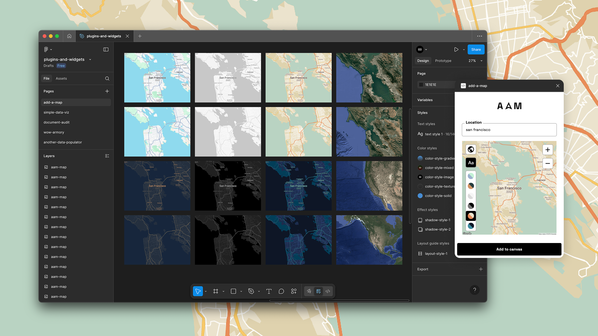

# Add a Map

Add a Map is a Figma plugin that lets you insert customizable static maps directly into your design canvas — perfect for mockups, presentations, or location-based UI components.

## Features

### Two map types
Choose between Roadmap and Satellite views.

###	Six roadmap styles
- Standard
- Night
- Light
- Dark
- Retro
- Aubergine
_Each style is available with or without labels for visual flexibility._

### Zoom control
Adjust map zoom interactively to focus on cities, neighborhoods, or landmarks.

### Smart placement
Automatically fits the map to your current selection’s size and position.

### Instant preview
See your map update live as you change location, style, or zoom level.